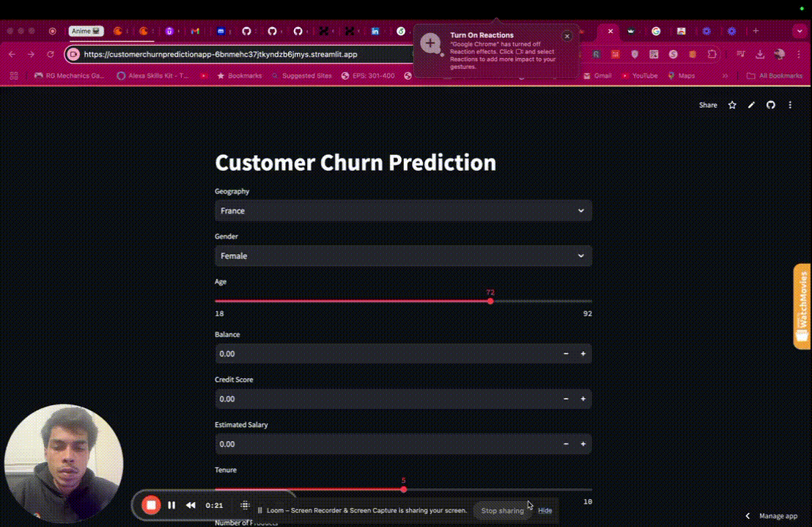

# Customer Churn Prediction

A machine learning-powered application for predicting customer churn using a pre-trained model. This project demonstrates the efficient use of serialized model components to enhance reusability and deployment, offering an interactive interface via Streamlit for real-time predictions.

---

## 🚀 Live Demo
**Deployed Website:** [Visit Here](https://customerchurnpredictionapp-6bnmehc37jtkyndzb6jmys.streamlit.app/)  


---

## 📹 Demo

  

This demonstration shows how users can input customer data and get real-time churn predictions through the interactive Streamlit app.

---

## Key Features
- **Interactive Interface:** Built using Streamlit for seamless user experience.
- **Custom-trained Model:** Predicts customer churn with high accuracy.
- **Reusable Components:** Serialized model (`.h5`) and preprocessing objects (`.pkl` files) for scalable and maintainable AI solutions.
- **Modular Design:** Easy integration and deployment in real-world use cases.

---

## Installation

1. Clone this repository:
   ```bash
   git clone https://github.com/username/Customer-Churn-Prediction.git
   cd Customer-Churn-Prediction

2. Setup a virtual environment
   ```bash
   python -m venv venv
   source venv/bin/activate

3. Install Dependencies
   ```bash
   pip install -r requirements.txt

## Usage

1. Run the Application
   ```bash
   streamlit run app.py

2. Input Customer Data
Use the interactive interface to input customer  attributes

3. View Results
Get real-time predictions on whether a customer is likely to churn.